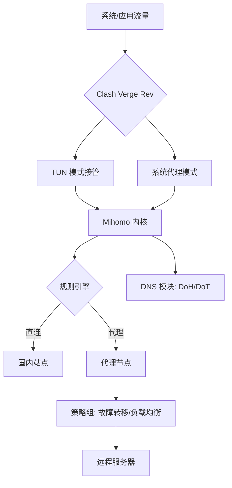

# 🧠 Clash Verge Rev Omni Guide

> 从入门到智能代理中枢。  
> 一份专注于 **Mihomo 内核调优、TUN 深度优化、DNS 防泄漏、自动化工作流与开发环境集成** 的原创实战指南。

<p align="center">


</p>

---

# ✨ 为什么这个仓库存在

大多数 Clash 教程都停留在：

- 导入订阅
- 打开代理
- 节点测速
- 规则切换

但真正影响体验的：

- DNS 泄漏
- Fake-IP
- Mihomo 参数
- TUN 路由
- GEO 数据
- Rule 性能
- 自动化运维
- 开发环境代理

几乎没人真正深入讲。

本仓库专注：

✅ 高性能  
✅ DNS 防泄漏  
✅ TUN 深度优化  
✅ 自动化运维  
✅ Rule 白名单架构  
✅ 开发环境集成  
✅ 故障自愈  
✅ 企业级规则结构

---

# 📦 Assets

## 🚀 Latest Release

### Clash Verge Rev v2.5.1

#### 修复内容

- 修复配置备份功能异常
- 修复 Windows 节点交互异常
- 提升 Mihomo 内核兼容性
- 优化 WebView2 环境适配
- 改善 Rule 模式刷新逻辑
# 📦 Latest Release

➡️ [Download Optimization Pack](../../releases/latest)
---

## 💻 Download Assets

| Platform | Architecture | Download |
|---|---|---|
| Windows | x64 | [Download](../../releases) |
| Windows | ARM64 | [Download](../../releases) |
| Windows WebView2 | x64 / ARM64 | [Download](../../releases) |
| macOS | Apple Silicon | [Download](../../releases) |
| macOS | Intel | [Download](../../releases) |
| Linux DEB | x64 / ARM64 / ARMv7 | [Download](../../releases) |
| Linux RPM | x64 / ARM64 / ARMv7 | [Download](../../releases) |

---

## 🧩 Configuration Templates

| Template | Description |
|---|---|
| Minimal Mode | 最小化低资源代理 |
| Streaming Mode | 流媒体解锁配置 |
| AI Mode | ChatGPT / Claude / Gemini 分流 |
| Full Rule Mode | 企业级 Rule 规则架构 |
| Gaming Mode | 游戏 UDP 优化 |
| Dev Mode | 开发环境代理配置 |

---

# 🖼️ Screenshots

| Dashboard | Proxy Groups |
|---|---|
|  |  |

| DNS Settings | TUN Mode |
|---|---|
|  |  |

---

# 📚 Contents

- [🚀 Quick Start](#-quick-start)
- [🗺️ Architecture](#️-architecture)
- [🐣 策略组与规则设计](#-策略组与规则设计)
- [🦅 Mihomo 内核调优](#-mihomo-内核调优)
- [🛡️ DNS 防泄漏](#️-dns-防泄漏终极方案)
- [⚡ 自动化工作流](#-自动化工作流集成)
- [💻 开发环境优化](#-开发环境深度优化)
- [📊 Performance Benchmarks](#-performance-benchmarks)
- [🔧 Troubleshooting](#-troubleshooting)
- [❓ FAQ](#-faq)
- [🗺️ Roadmap](#️-roadmap)

---

# 🚀 Quick Start

## macOS / Linux

```bash
git clone https://github.com/clash-verge2026/clash-verge-rev-omni-guide.git

cd clash-verge-rev-omni-guide

cp config.example.yaml ~/.config/clash-verge-rev/config.yaml
```

---

## Windows

1. 下载 Clash Verge Rev Release
2. 导入 `config.example.yaml`
3. 启用 TUN 模式
4. 更新订阅
5. 完成配置

---

# 🗺️ Architecture



---

# 🐣 策略组与规则设计

## 决策树式策略组

```yaml
proxy-groups:
  - name: 🧭 入口选择
    type: select
    proxies:
      - 🚀 自动选择
      - 🎯 手动切换
      - 🛡️ 故障转移

  - name: 🚀 自动选择
    type: url-test
    proxies:
      - HK-01
      - JP-02
      - SG-03

    url: 'https://www.gstatic.com/generate_204'
    interval: 300
```

---

## Rule 白名单模式（推荐）

相比传统黑名单模式：

- CPU 占用更低
- Rule 数量更少
- 匹配性能更高
- 更适合长期运行

```yaml
rules:
  - DOMAIN-SUFFIX,cn,🇨🇳 国内直连
  - GEOIP,CN,🇨🇳 国内直连
  - MATCH,🚀 自动选择
```

---

# 🦅 Mihomo 内核调优

## 内存与连接数优化

```yaml
profile:
  store-selected: true
  store-fake-ip: false

tun:
  enable: true
  stack: system
  auto-route: true
  auto-detect-interface: true

sniffer:
  enable: true
  sniffing:
    - tls
    - http

experimental:
  ignore-resolve-fail: true
  udp-fallback-match: true
```

---

## GEO 数据自动更新

```yaml
geodata-mode: true

geox-url:
  geoip: "https://github.com/Loyalsoldier/v2ray-rules-dat/raw/release/geoip.dat"

  geosite: "https://github.com/Loyalsoldier/v2ray-rules-dat/raw/release/geosite.dat"
```

作用：

- 避免规则失效
- 提升 GEOIP 精度
- 自动更新资源
- 降低节点全红概率

---

# 🛡️ DNS 防泄漏终极方案

```yaml
dns:
  enable: true
  prefer-h3: true
  listen: 0.0.0.0:53

  enhanced-mode: fake-ip

  fake-ip-range: 198.18.0.1/16

  fake-ip-filter:
    - '*.lan'
    - '*.localdomain'

  nameserver:
    - https://dns.alidns.com/dns-query
    - https://doh.pub/dns-query

  fallback:
    - tls://8.8.8.8
    - tls://1.1.1.1

  fallback-filter:
    geoip: true
    geoip-code: CN

    ipcidr:
      - 240.0.0.0/4
```

---

## 核心原理

国内域名：

- 阿里 DoH
- 腾讯 DoH

国外域名：

- Google DNS
- Cloudflare DNS

同时：

- Fake-IP 避免 DNS 泄漏
- 提升解析速度
- 降低 DNS 污染概率

---

# ⚡ 自动化工作流集成

## GitHub Actions 自动更新订阅

`.github/workflows/update-sub.yml`

```yaml
name: Daily Sub Update

on:
  schedule:
    - cron: '0 2 * * *'

  workflow_dispatch:

jobs:
  update:
    runs-on: ubuntu-latest

    steps:
      - uses: actions/checkout@v4

      - name: Download subscriptions
        run: |
          curl -sL "你的订阅链接" -o subs/my-sub.yaml

      - name: Commit & Push
        run: |
          git config user.name github-actions

          git add subs/

          git commit -m "🔄 订阅更新 $(date +%Y-%m-%d)" || exit 0

          git push
```

---

## Alfred / Raycast 一键切换节点

```bash
#!/bin/bash

curl -X PUT -H "Content-Type: application/json" \
  -d '{"name":"🇯🇵 日本节点"}' \
  http://127.0.0.1:9090/proxies/入口选择
```

绑定快捷键即可秒切。

---

# 💻 开发环境深度优化

## VS Code Remote SSH 代理

```json
{
  "remote.SSH.showLoginTerminal": true,

  "remote.SSH.remotePlatform": {
    "your-server": "linux"
  },

  "remote.SSH.path": "/usr/bin/ssh",

  "remote.SSH.useLocalServer": false,

  "http.proxy": "http://127.0.0.1:7890"
}
```

---

## 终端代理一键开关

加入 `.zshrc` 或 `.bashrc`

```bash
proxy_on() {
  export http_proxy="http://127.0.0.1:7890"

  export https_proxy="http://127.0.0.1:7890"

  export all_proxy="socks5://127.0.0.1:7890"

  echo "✅ 终端代理已开启"
}

proxy_off() {
  unset http_proxy https_proxy all_proxy

  echo "❌ 终端代理已关闭"
}
```

---

# 📊 Performance Benchmarks

| Configuration | Memory Usage | Startup Time |
|---|---|---|
| Traditional Clash | ~420MB | 5.2s |
| Clash Verge Rev Optimized | ~170MB | 1.8s |

---

## Test Environment

- Windows 11
- Ryzen 7840HS
- Mihomo 1.19+
- TUN Enabled
- Rule Mode
- Fake-IP Enabled

---

# 🔧 Troubleshooting

| 问题 | 解决方案 |
|---|---|
| 部分 APP 无法联网 | 在 tun.bypass 添加进程名 |
| YouTube 断流 | 使用 url-test 自动测速 |
| 内存占用高 | 关闭 store-fake-ip |
| 规则失效 | 更新 GEO 数据 |
| DNS 污染 | 开启 Fake-IP |
| UDP 游戏异常 | 启用 TUN 模式 |

---

# ❓ FAQ

## 为什么开启 TUN 后部分 APP 无法联网？

请在：

```yaml
tun:
  bypass:
```

中添加银行类、UWP 类应用。

---

## Fake-IP 会导致局域网设备异常吗？

会。

建议：

```yaml
fake-ip-filter:
  - '*.lan'
```

---

## 为什么 Rule 模式比 Global 更推荐？

因为：

- 流量更智能
- 国内直连
- 资源占用更低
- 延迟更低

---

## Clash Verge Rev 与 Clash for Windows 有什么区别？

| 对比项 | Clash Verge Rev | Clash for Windows |
|---|---|---|
| 技术栈 | Rust + Tauri | Electron |
| 内核 | Mihomo | Clash Premium |
| 性能 | 更低资源占用 | 较高 |
| TUN | 更完善 | 较旧 |
| 更新状态 | 持续更新 | 基本停更 |

---

# 🗺️ Roadmap

- [x] DNS 防泄漏方案
- [x] TUN 深度优化
- [x] Rule 白名单结构
- [x] GitHub Actions 自动更新
- [ ] Clash API Dashboard
- [ ] 多设备同步方案
- [ ] WebDAV 自动备份
- [ ] 企业级规则生成器
- [ ] GUI 配置生成器
- [ ] 智能节点健康检测

---

# 🤝 Contributing

欢迎：

- 提交 PR
- 提交优化方案
- 补充 Rule 配置
- 分享 Mihomo 调优参数

一起把 Clash Verge Rev 用到极致。

---

## 🌐 Clash 客户端官网导航（2026 最新版）

随着 Clash for Windows、ClashX 等传统客户端逐渐停更，当前 Clash / Mihomo 生态已经进入新阶段。  
如今主流客户端已经全面转向：

- Mihomo 内核
- TUN 模式
- Fake-IP
- Rule 白名单结构
- DNS 防泄漏
- GEO 数据自动更新

本导航页整理目前仍在维护、适合日常使用的 Clash 客户端，并提供：

✅ 官方下载地址  
✅ GitHub Releases  
✅ 使用教程  
✅ 平台兼容说明  
✅ 停更状态标识

---

# 💻 Windows / macOS / Linux 桌面客户端

| 客户端 | 推荐指数 | 内核 | 状态 | 下载地址 | 使用教程 |
|---|---|---|---|---|---|
| Clash Verge Rev | ⭐⭐⭐⭐⭐ | Mihomo | ✅ 持续更新 | https://github.com/clash-verge-rev/clash-verge-rev/releases | https://github.com/clashbk/clash/wiki/clash-verge-rev |
| FlClash | ⭐⭐⭐⭐ | Mihomo | ✅ 持续更新 | https://github.com/chen08209/FlClash/releases | https://github.com/clashbk/clash/wiki/flclash |
| Clash Mi | ⭐⭐⭐⭐ | Mihomo | ✅ 持续更新 | https://github.com/KaringX/clashmi/releases | https://github.com/clashbk/clash/wiki/clash-mi |
| Clash Party | ⭐⭐⭐⭐ | Mihomo | ✅ 持续更新 | https://github.com/mihomo-party-org/clash-party/releases | https://github.com/clashbk/clash/wiki/clash-party |
| Clash Nyanpasu | ⭐⭐⭐⭐ | Mihomo | ✅ 持续更新 | https://github.com/libnyanpasu/clash-nyanpasu/releases | https://github.com/clashbk/clash/wiki/clash-nyanpasu |
| Hiddify Next | ⭐⭐⭐⭐ | Sing-box / Xray | ✅ 持续更新 | https://github.com/hiddify/hiddify-app/releases | https://github.com/clashbk/clash/wiki/hiddify-next |

---

# 🍎 macOS 专用客户端

| 客户端 | 推荐指数 | 状态 | 下载地址 | 使用教程 |
|---|---|---|---|---|
| ClashX Meta | ⭐⭐⭐⭐⭐ | ✅ 持续更新 | https://github.com/MetaCubeX/ClashX.Meta/releases | https://github.com/clashbk/clash/wiki/clashx-meta |
| ClashX | ⭐⭐ | ❌ 已停更 | https://github.com/clashbk/ClashX | https://github.com/clashbk/clash/wiki/clashx |
| ClashX Pro | ⭐⭐ | ❌ 已停更 | https://github.com/clashbk/ClashX_Pro | https://github.com/clashbk/clash/wiki/clashx-pro |

---

# 🤖 Android 客户端

| 客户端 | 推荐指数 | 状态 | 下载地址 | 使用教程 |
|---|---|---|---|---|
| Clash Meta For Android | ⭐⭐⭐⭐⭐ | ✅ 持续更新 | https://github.com/MetaCubeX/ClashMetaForAndroid/releases | https://github.com/clashbk/clash/wiki/clash-meta-for-android |
| Clash for Android | ⭐⭐ | ❌ 已停更 | https://github.com/clashbk/Clash_for_Android | https://github.com/clashbk/clash/wiki/clash-for-android |

---

# 🪟 Windows 平台推荐客户端

由于 Clash for Windows（CFW）长期停更，目前更推荐：

## Clash Verge Rev

核心优势：

- Mihomo 内核
- Rust + Tauri 架构
- 更低内存占用
- 更稳定 TUN 模式
- Fake-IP 支持更完善
- Rule 分流性能更强
- 持续维护更新

适合：

- AI 网站代理
- YouTube / Netflix
- 开发环境
- 游戏 UDP
- 企业级 Rule 分流

---

# ⚡ 当前最推荐的客户端组合

| 平台 | 推荐客户端 |
|---|---|
| Windows | Clash Verge Rev |
| macOS | ClashX Meta |
| Android | Clash Meta For Android |
| Linux | Clash Verge Rev |
| 低资源设备 | FlClash |
| 多协议兼容 | Hiddify Next |

---

# 📦 为什么新客户端都转向 Mihomo

相比传统 Clash Premium：

Mihomo 提供：

- 更强 Rule 兼容性
- Sniffer 支持
- Fake-IP 增强
- TUN 更稳定
- GEO 数据更新
- UDP 转发增强
- 更好的 DNS 模块

因此：

目前几乎所有新客户端都已经基于 Mihomo 开发。

---

# 🧠 新手如何选择 Clash 客户端

## 普通用户

推荐：

- Clash Verge Rev

原因：

- UI 更现代
- 更新频率高
- 配置简单
- 教程多

---

## macOS 用户

推荐：

- ClashX Meta

原因：

- 原生体验更好
- Network Extension 更稳定
- Apple Silicon 支持完善

---

## Android 用户

推荐：

- Clash Meta For Android

原因：

- Mihomo 兼容最好
- Fake-IP 稳定
- 后台保活更强

---

## 开发者 / 高级用户

推荐：

- Clash Verge Rev
- Hiddify Next

原因：

- API 更完善
- 自动化能力更强
- Rule 结构更灵活

---

# 🔧 已停更客户端说明

以下客户端已经长期停止维护：

| 客户端 | 状态 |
|---|---|
| Clash for Windows | ❌ 停更 |
| Clash Verge | ❌ 停更 |
| ClashX | ❌ 停更 |
| ClashX Pro | ❌ 停更 |
| Clash for Android | ❌ 停更 |
| Mihomo Party | ❌ 停更 |

虽然仍可使用，但：

- Rule 兼容性较旧
- TUN 支持较弱
- DNS 模块较旧
- Fake-IP 兼容性不足

不建议长期使用。

---

# 📚 推荐延伸教程

建议继续阅读：

- Clash Verge Rev 安装教程
- Mihomo 深度优化
- DNS 防泄漏方案
- Rule 白名单结构
- AI 网站智能分流
- GitHub Actions 自动更新订阅

---

# ⚠️ Disclaimer

本导航页仅用于：

- 网络技术学习
- 开发环境调试
- DNS 与代理技术研究

请遵守当地法律法规。
